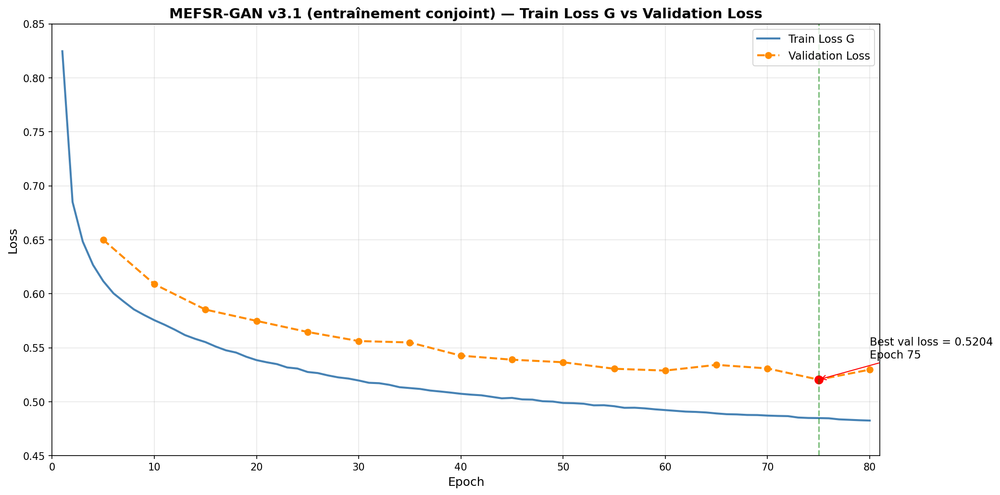
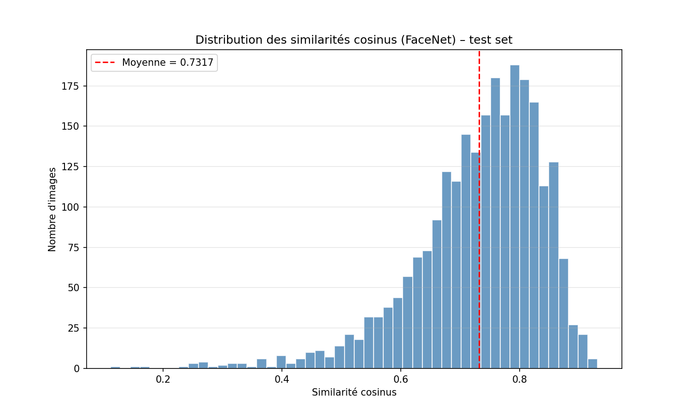
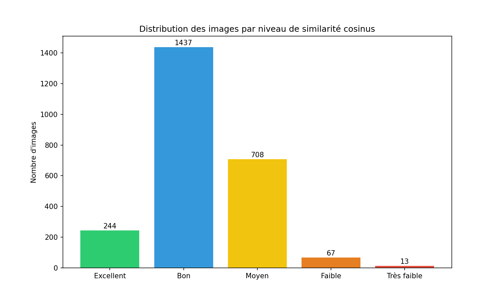
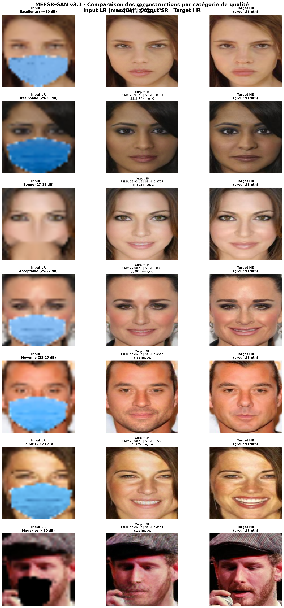

# MEFSR-GAN : Super-résolution de visages masqués

**Masked Edge-guided Face Super-Resolution GAN** — Projet de Fin d'Études (PFE)

Architecture de deep learning permettant de **retirer l'occlusion d'un masque facial** et de réaliser une **super-résolution ×4** (32×32 → 128×128) en une seule passe end-to-end.

> 🎓 Master Génie Informatique et Mathématiques pour la Data Science — ENSA Khouribga
> **Auteure :** Sara Maggag
> **Encadrement :** Pr. Lamghari Nidal (superviseur), Yazid Safiny (co-superviseur)
> **Jury :** Pr. Soussi (Président), Pr. Tabaa (Examinateur), Pr. Lamghari Nidal (Superviseur)

---

## 📌 Contexte

Avec la généralisation du port du masque facial (contexte sanitaire, sécurité), de nombreux systèmes de reconnaissance faciale se retrouvent confrontés à des images à la fois **occluses** et **basse résolution**. Ce projet propose une architecture unique capable de traiter ces deux problèmes simultanément, contrairement aux approches classiques qui les traitent séparément (d'abord démasquage, puis super-résolution — ou l'inverse).

## 🧠 Architecture — MEFSR-GAN

L'architecture combine :
- Des **blocs RRDB** (Residual-in-Residual Dense Blocks) comme backbone
- Un module **PixelShuffle** pour l'upsampling ×4
- Un discriminateur **PatchGAN** avec formulation adversariale **LSGAN**
- Une fonction de perte composite (pixel, perceptuelle VGG16, SSIM, adversariale, identité)

### 🔑 Contribution principale : EdgeFusionAttention

Le module **EdgeFusionAttention** est l'apport original de ce travail : il combine la **détection de contours de Canny** avec un mécanisme d'attention de type **CBAM** (canal + spatial), pour guider la reconstruction des structures faciales fines (yeux, nez, contours) tout en supprimant la zone masquée.

> *"1er modèle combinant contours Canny + suppression de masque (EdgeFusionAttention) pour une double tâche end-to-end : démasquage + SR ×4 en une seule passe."*

**Points forts de l'architecture :**
- 🪶 **9,4 M de paramètres** → **3,9× plus léger** que JDSR-GAN (baseline de référence)
- 🧩 Architecture **modulaire** : chaque composant est remplaçable indépendamment
- 🎯 Double tâche en une seule passe (pas de pipeline séquentiel)


## 📊 Dataset

- **Source :** CelebA-HQ, avec masques synthétiques appliqués
- **Répartition :**
  | Split | Nombre de paires |
  |---|---|
  | Train | 19 742 |
  | Validation | 2 467 |
  | Test | 2 469 |
- **Format :** entrée 32×32 (image masquée) → sortie 128×128 (image restaurée, ×4)
- **Limite connue :** ~24k paires utilisées contre 162k dans CelebA complet → peut limiter la capacité de généralisation ; masques synthétiques uniquement (pas de masques réels variés)

> Le dataset complet n'est pas hébergé sur ce dépôt (volumineux). Il est disponible sur Kaggle : **[masked-celebahq-images](https://www.kaggle.com/datasets/saramaggag/masked-celebahq-images)**. Voir [`data/README.md`](./data/README.md) pour les instructions détaillées.

## 🏆 Résultats — Modèle final (v3.1)

| Métrique | Valeur |
|---|---|
| **PSNR** | 24,49 ± 2,38 dB |
| **SSIM** | 0,7902 |
| **Préservation de l'identité** (FaceNet, similarité cosinus) | **96,8 %** |

**Note sur le PSNR :** bien que la moyenne (24,49 dB) soit légèrement sous le seuil cible de 25 dB, l'écart-type de ±2,38 dB signifie qu'**environ 45 % des images de test dépassent individuellement ce seuil**, ce qui nuance la lecture de la performance moyenne.

### 🖼️ Résultats visuels




### 🧬 Évaluation de la préservation d'identité (FaceNet)

La préservation de l'identité a été évaluée en calculant la **similarité cosinus** et la **distance euclidienne** entre les embeddings **FaceNet** de l'image reconstruite et de l'image de référence (ground truth).

| Métrique | Résultat |
|---|---|
| Similarité cosinus moyenne (identité préservée) | **96,8 %** |
| Distance euclidienne moyenne | voir [`rapport_synthese.txt`](./identity_evaluation/identity_evaluation_report_20260606_173608/rapport_synthese.txt) |





> Détails complets et méthodologie dans [`identity_evaluation/`](./identity_evaluation/).

### Comparaison des versions du modèle

| Version | Architecture / Configuration | Ép. | PSNR (dB) | SSIM |
|---|---|---|---|---|
| Bicubique | Interpolation bicubique (baseline) | – | 23,00 | 0,6500 |
| v1.0.1 | ResNet (8 blocs) + MSE + Percep + ID | 100 | 24,61 | 0,7841 |
| v1.0.2 | ResNet + MSE + Percep + ID + SSIM | 100 | 24,80 | 0,8090 |
| v1.0.3 | ResNet + MAE×0,8+MSE×0,2 + Percep + ID + SSIM + Aug | 100 | 25,03 | 0,8163 |
| v2.0 | ESRGAN (12 RRDB) + Attention + MSE + Percep + ID + SSIM + Aug | 100 | 23,57 | 0,7915 |
| v2.0 Light | ESRGAN (4 RRDB) + Attention + MSE + Percep + ID + SSIM + Aug | 200 | 24,82 | 0,8128 |
| v2.0 L. New | ESRGAN (4 RRDB) + Attention + MAE×0,8+MSE×0,2 | 150 | 24,46 | 0,8588* |
| v3.0 Phase 1 | 3 modules (MaskRemoval + EdgeFusion + ESRGAN 8 RRDB), sans discriminateur | 50 | 24,28 | – |
| v3.0 GAN | Générateur v3.0 + PatchGAN LSGAN + corr. drift (ép. 65) | 80 | 23,45 ± 2,19 | 0,7711 ± 0,0675 |
| **v3.1 GAN (conjoint)** ✅ | **Générateur v3.0 + PatchGAN LSGAN, entraînement conjoint** (LR_D=10⁻⁵, λ_adv=0,01, λ_pixel=0,8) | 80 | **24,49 ± 2,38** | **0,7902 ± 0,0623** |
| v4 (WGAN-GP) | Générateur v3.0 + critique WGAN-GP, pré-entraîné G (60 ép.) puis 15 ép. conjointes | 75 | 24,58 ± 2,42 | 0,7277 ± 0,0657 |

<sub>* SSIM calculé sans fenêtrage gaussien (implémentation globale) — non comparable aux autres versions qui utilisent `pytorch_msssim` avec fenêtrage gaussien 11×11. Valeur indicative uniquement.</sub>

La stratégie d'entraînement **conjointe (end-to-end)** avec 8 blocs RRDB (v3.1) surpasse les approches en deux phases et le WGAN-GP, offrant le meilleur compromis fidélité/réalisme perceptuel — c'est la **version finale retenue**.



### Comparaison avec l'état de l'art

| Méthode | Année | Tâche | Dataset | Nb images | Masque | Résolution | PSNR | SSIM |
|---|---|---|---|---|---|---|---|---|
| FCSR-GAN | 2019 | Complétion + SR | CelebA | 162 770 | Oui | ×4 | 24,75 | 0,761 |
| JDSR-GAN | 2023 | SR visages masqués | CelebA | 162 770 | Oui | ×4 | 29,18 | 0,855 |
| v1.0.3 | 2026 | SR masqués | CelebA-HQ | 24 678 | Oui | ×4 | 25,03 | 0,8163 |
| v2.0 Light | 2026 | ESRGAN + Attention | CelebA-HQ | 24 678 | Oui | ×4 | 24,82 | 0,8128 |
| v3.0 GAN | 2026 | 3 modules + PatchGAN | CelebA-HQ | 24 678 | Oui | ×4 | 23,45 | 0,7711 |
| **v3.1 GAN** ✅ | 2026 | LSGAN conjoint | CelebA-HQ | 24 678 | Oui | ×4 | **24,49** | **0,7902** |
| v4 (WGAN-GP) | 2026 | WGAN-GP | CelebA-HQ | 24 678 | Oui | ×4 | 24,58 | 0,7277 |

> **À noter :** JDSR-GAN atteint un PSNR/SSIM supérieur, mais est entraîné sur **6,6× plus de données** (162 770 vs 24 678 images). MEFSR-GAN reste compétitif avec un dataset nettement plus restreint et une architecture **3,9× plus légère** (9,4 M de paramètres).

### 🖼️ Résultats qualitatifs par version

**v1**


**v2**


**v3.0 GAN**


**v3.1 GAN (conjoint) — version finale ✅**


**v4 WGAN-GP**


### Étude d'ablation — apport des composantes

- L'ajout de la **perte SSIM** améliore la similarité structurelle (**+0,19 dB**)
- Le remplacement de la MSE par un mix **MAE prédominant** + augmentation de données améliore netteté et PSNR (**+0,23 dB**)
- La **perte perceptuelle** (VGG16) est le contributeur le plus fort (**+0,51 dB**)
- **4 blocs RRDB** surpassent 12 blocs sur des entrées 32×32 (moins de sur-paramétrage)
- Le **lissage gaussien** en post-traitement réduit le PSNR de ~0,32 dB sans bénéfice visuel notable → non retenu

## 🐛 Défis techniques résolus pendant l'entraînement

| Problème | Cause | Solution |
|---|---|---|
| PSNR anormalement bas (~6 dB) | Incohérence de normalisation ([0,255] vs [-1,1] à l'évaluation) | Alignement des pipelines d'entraînement et d'évaluation |
| Inversion des couleurs (BGR) | Erreur dans la génération des masques | Correction de l'ordre des canaux |
| Collapse du discriminateur | Discriminateur trop dominant | Réduction du LR discriminateur (1e-4 → 1e-5), mise à jour toutes les 2 itérations |

## 📁 Structure du dépôt

```
MEFSR-GAN-masked-face-super-resolution/
│
├── data/                        → instructions de téléchargement du dataset (fichiers non inclus)
│   └── README.md
├── Articles/                    → articles de recherche ayant inspiré l'architecture
├── Documents/                   → rapport PFE (PDF) et présentation de soutenance (PPTX)
├── Versions/                    → code source de chaque version du modèle
│   ├── v1.0.3/                  → notebook, courbes, logs, métriques
│   ├── v2_light/
│   ├── v3.0_GAN/
│   │   ├── phase 1/             → entraînement sans discriminateur
│   │   └── phase 2/             → entraînement GAN complet
│   ├── v3.1_GAN_conjoint/       → version finale retenue
│   └── v4_WGAN_GP/
├── identity_evaluation/         → évaluation de la préservation d'identité (FaceNet)
│   └── identity_evaluation_report_20260606_173608/
├── assets/                      → images et schémas utilisés dans ce README
├── .gitignore
├── LICENSE
└── README.md
```

Chaque dossier de version contient : notebook d'entraînement, logs d'entraînement, courbes, et fichiers de métriques finales.

## 🔧 Stack technique

- **Entraînement :** Kaggle (GPU T4/P100, sessions de 12h max, reprise multi-session via checkpoints)
- **Framework :** PyTorch
- **Composants clés :** RRDB, PixelShuffle, CBAM, PatchGAN, perte perceptuelle VGG16, perte adversariale LSGAN
- **Évaluation :** PSNR, SSIM, embeddings FaceNet (similarité cosinus + distance euclidienne)

## 📥 Modèles pré-entraînés

Les poids des modèles (checkpoints `.pth`) ne sont pas hébergés sur GitHub en raison de leur taille. Ils sont disponibles ici :

| Version | Lien |
|---|---|
| v3.1 (finale) | *[à compléter — lien Kaggle/Hugging Face]* |
| v3.0 | *[à compléter]* |
| v4 WGAN-GP | *[à compléter]* |

## 🚀 Perspectives

- **Court terme :** détection automatique de l'occlusion (sans masque binaire fourni en entrée) ; validation sur images réelles
- **Moyen terme :** super-résolution multi-facteur (×2, ×4, ×8) via blocs conditionnels ; généralisation à d'autres occlusions (lunettes, écharpes, mains)
- **Long terme :** apprentissage auto-supervisé pour la suppression du masque sans paires étiquetées (ex. inpainting conditionné par la région visible)

## 📄 Documents

- [Rapport PFE complet](./Documents/RAPPORT_PFE_SARA_MAGGAG.pdf)
- [Présentation de soutenance](./Documents/new_%20version_%20of_PRESENTION_SARA_MAGGAG.pptx)

## 📜 Licence

Ce projet est distribué sous licence MIT — voir [LICENSE](./LICENSE).

## ✉️ Contact

Sara Maggag — Master Génie Informatique et Mathématiques pour la Data Science, ENSA Khouribga
